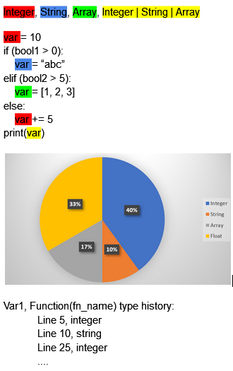

# Milestone 1
### Discussions on Ideas
#### Candidate ideas
- Control flow visualization. Mapping logical paths into a tree for visualization
- Linter for syntax and type checking. Highlighting & statistics for visualization
- Stack visualization
- Hierarchy visualization (of superclass, interfaces, etc.), similar to UML diagrams
#### Discussions
- By defining the problem statement and target audience, we can easily limit the complexity, length, and scope of the intended input program of our analysis tool. For example, we could argue that the control flow visualization tool is meant for providing visual aid of the execution process to entry level or beginner programmers. The assumption of short and simple inputs should address control flow visualization’s complexity problem.

### TA Feedback
- Control flow can get overly complex when analyzing the entire program
- Recommended to perform analyses on a subset of the program, such as methods
- Analyze a subset of the programming language to avoid complex processes such as dynamic dispatch and reflection
- Focus on the visualization if program analysis is lacking

### Follow-up Tasks
- Decide on which programming language to focus on
- Pick the idea to implement
- Sketch out the process of our analysis idea
- Flesh out the details of ideas, finalize the appropriate subset of the programming language we choose
- Design details and features

# Milestone 2
### Brief Description of Your Planned Program Analysis (& Visualisation, if Applicable) Ideas
#### Problem statement
Static program analysis of variable types in a Python program.
#### Features
Visualization includes: statistics; graphs, such as a pie chart showing type distribution; Color coding different types in the code; The analysis shall be performed globally and on a per-variable basis. The type history of each variable name should be recorded. Globally, the total distribution of types could be analyzed as statistics. For example, we could present a count of the total number of types, total number of variables with ambiguous types, and the total number of type changes in a given program.
#### Target audience
Entry level python users whose programs are not overly complex and involve only a set of popular python libraries, such as NumPy. Custom classes should be allowed as well. The input program should contain operations that result in a variable conditionally changing types during program execution. Type consistency could also be used as a measure for code quality.
#### Visualization samples (mockup)

### TA Feedback
- Static analysis would be ideal for this project idea, as performing dynamic analysis would be as simple as inserting code to wherever the variable type is ambiguous.
- Project should include non-trivial analysis, such as inferring, approximating, and estimating information. 
### Follow-up Tasks/Features Still to Design
- Consider type casting and its effects
- Consider linting?
- Investigate libraries for parsing the source code
- Narrow down the set of python libraries to analyze
- Learn more about usable visualization tools
### Division of Tasks
To be determined once the project starts to take shape. Meanwhile, all tasks are to be handled as a group activity.
### Roadmap 
- Design user study
- Find participant
- Think of more features
- Start implementation

# Milestone 3
### Visual Mockup
#### Note: Design Not Final

### User Study
#### Question 1  
Describe how the type of var changes with the code’s execution. Perform type analysis on the variable var when the code executes line 8.   

    1    var = 10
    2    rand_bool = 0 or 1 or 2 uniform random 
    3    if (rand_bool == 2):
    4        var = “abc”
    5    elif (rand_bool == 1):
    6        var = [1, 2, 3]
    7    else:
    8        var += 5
    9    print(var)
##### Solution:  
Var:  
rand_bool == 0, 1/3 probability, int from start to finish 
rand_bool == 1, 1/3 probability, int @ line 1 -> array @ line 6 to finish 
rand_bool == 2, 1/3 probability, int @ line 1 -> string @ line 4 to finish 
At line 9, var could be either an int, string, or array each with 1/3 probability. 

#### Question 2 
Perform type analysis on the variables a, b, and c. Consider both the error and valid cases. Draw clues from the implementation. For the purposes of this exercise, consider only the following types: int, float, boolean, string, list, tuple, dictionary, and set. 

    1    c = a + b.split(“.”)
##### Solution: 
Error case: b is not a string. Error thrown. 
Error case: a is not an array/list. Error thrown. 
Valid case: split only works on string inputs, thus b must be a string. b.split(“.”) will separate the string b by “.” and return a list. Addition only works when both sides are arrays, thus variable a must also be an array. Since a and b.split are both arrays, c must also be an array. 

#### Question 3 
Perform type analysis on the variables in the function foo(a, b). Consider both the error and valid cases. Draw clues from the implementation. For the purposes of this exercise, consider only the following types: int, float, boolean, string, list, tuple, dictionary, and set. 

    1    def foo(a, b):
    2        c = a[0] + b[0]
    3        print(c)
    4    def main():
    5        a = ??? <-- unknown
    6        b = ??? <-- unknown
    7        foo(a, b)
##### Solution: 
Both variables, a and b, undergo index accesses, then they must be either one of list, string, tuple, dictionary with keys of 0. For a[0] + b[0] to work, both terms are likely the same type. String + string, int/float/bool + int/float/bool, list + list, or tuple + tuple. Thus, c could be either a string, int, float, boolean, list, or tuple. 

#### Question 4 
After doing type analysis by hand, do you feel that a tool for performing type analysis automatically would be beneficial to python programmers? Any features you would like to see or use in a type analysis tool?  

### User Study Results
##### Question 1
- The user had to consider the possible values for the random boolean to analyze each branch of the if-statement to infer the possible types for var at line 9.
- The user correctly answered that it can be any of the three types with probability 1/3.
##### Question 2
- The user had no problem with identifying the types for variables a, b, c. 
- Also identified the possible error cases if b is not the correct type for splitting and when a is not the correct type for the addition operator.
##### Question 3
- The user correctly identified int, float, boolean cannot be possible answers.
- The user was not really familiar with how some types can be accessed with the bracket notation, such as when the variable is a dictionary or a set.
-The user had to manually consider the different combinations of a[0] and b[0] to infer the possible type of c.
##### Question 4
- The user thought that a tool which could do this automatically would be very helpful. The user is more familiar with matlab, so the user compares some type errors that occur in python and matlab.
##### Reflection about the user study
- It can be very tedious for a user to have to step through all lines of code to identify the possible type of one variable. Especially if we were to analyze large blocks of code, it would not be an easy task. Particularly, this task can become very difficult for inexperienced programmers, which is our target audience, so a tool to automatically execute a static type analysis should be very helpful as observed in the responses from our user study.

### Changes to Original Design
- Added features for error checking, such as type mismatch, faulty function parameters, etc. Decreased emphasis on the visualization component. Increased emphasis on the analysis component.
### Planned Timeline
- 11/19 Plan final user study and start considering participants
- 11/18 or 11/19 Finish implementing the static analysis portion of the project
- 11/23 or 11/24 Finish implementing the visual component 
- 11/25 or 11/26 Create the video for the project
### TA Feedback
- Should include type inference in function calls, such as when parameters are passed in, but we don’t have their types explicitly defined.
- Start thinking about actual use cases with complex examples for the static analysis. 
- No need to focus too much on visualization. 
- Try a branching flow chart instead of a scatter plot for the type history diagram.

# Milestone 4
### Status of Implementation
#### Control Flow
We have implemented the static analysis of conditional statements such as if/for/while/try-catch and their nested variants. We decided to overestimate the possible data types after we process the conditional branches, so we are taking the union of the possible types of a variable if it was modified inside a conditional block.
#### Operations
We can perform type check on unary operations (not, invert, +, -), boolean operations (and, or), and binary operations (+, -, *, /, **, %). In particular, we only let legal operations to be performed depending on the types of the variables used as operands. Illegal operations will result in an ‘Error’ assignment, whereas ambiguous types will result in an ‘Ambiguous’ assignment. 
#### Function Declaration
Arguments or variables of a function are instantiated with the function definition. We overestimate by starting these variables with all possible types. As each line of the body of the function is processed, we infer from operations involving the corresponding argument and prune the set of possible types to only retain types that will result in valid operations. This implementation aims to prioritize as many sequential lines as possible to execute without encountering errors.
#### Function Returns
Return types are based on the most recent assignment or type update for each corresponding variable.
#### Function Calls Parameter Type Inference
When calling a function, the parameters passed in will be type checked against the type inference done during function declaration. If every parameter passed in is a subset of the corresponding argument’s inferred types, then the function call is considered legal. If a parameter’s possible types only intersect with the corresponding argument’s inferred types, then the function call is considered ‘Ambiguous’. If a parameter’s possible types do not intersect with the corresponding argument’s inferred types, then the function call is considered ‘Error’.
#### Function Calls Internal
Internal function calls are supported.
#### Function Calls External
Calls to external libraries are supported if declared in the JSON mapping, read ‘Supported Libraries’ for more information. In addition, external calls can be chained, i.e. x = f1().f2().f3().
#### Function Calls Object
Object calls for built-in types are supported. For example, “aaa”.split() is legal if the split function is mapped under class ‘str’ in the JSON mapping.
#### Function Call Chaining
Chaining external calls are legal. External calls can be used with object calls. Chaining local and external currently not supported.
#### Function Overloading
Function definition overloading is supported. For example, a # parameter function is mapped as fn_name|#.
#### Types Checked
The types that can be checked so far are int, float, bool, str, list, tuple, set, dictionary.
#### Abstract State
The state for our static analysis is stored in a nested map with the following format {function name: {var name: {line number: possible type}}}.
#### Supported Libraries
We implemented a functionality that loads a map from a JSON file with the format  {class name: {function name: {return: {line number: possible type}}}}. This means that the possible external classes and their functions’ return types need to be included in this file before running the static analysis. 

### Final User Study Plans
- We plan to provide sample code to participants and ask for their feedback. 

### Planned Timeline
- 11/23 or 11/24 Finish implementing the visual component 
- 11/25 or 11/26 Create the video for the project

### TA Feedback
- The progress of our implementation is good. When implementing the static analysis, we should focus more on control flow. Additionally, we should check out the “Unification” algorithm which is used for type inference. This algorithm might be useful for implementing the static analysis, but it is not necessary.

# Milestone 5

### User study

    1  def foo(a, arg):
    2     b = 2
    3     c = 2.0
    4     d = '2.0'
    5     e = b + c
    6     f = b * d
    7     k = False
    8     if arg > 4:
    9         b = 2.5 + c
    10    elif arg == 4:
    11        b = '2.5' + d
    12    g = b
    13    return a + d
    14 
    15 def boo(k):
    16    tool_version = 2
    17    print(foo(tool_version,k))
    18    return numpy.random.randint(5)

#### Are you new to Python, or are you an experienced Python user? On a scale of 0 to 5, rate how well you know Python.
> The participant did learn Python in the past however he is still relatively inexperienced with Python.
#### Find the type of the parameters b, c, d, e, f and g. 
> b: int
> c: float
> d: string
> e: float
> f: string
> k: boolean
> g: not sure
#### What’s the return type of foo?
> “Might be string”
#### What’s the return type of boo?
> “int”
#### What type should a be?
> “string”
#### What type should arg be?
> “int”
#### How did you find the type of the parameters? Random guesses? Derived from code? Intuition?
> “Since the parameters are assigned with value, we can know the type of it. Derived from code.”

- The program is simple and therefore the participant managed to derive the types without too much trouble.

#### Find the type of the parameters b, c, d, e, f and g base on the analysis result.
> Same result as above
#### What’s the return type of foo?
> “The highlight on boo indicates that it is returning a string whereas the participant believes that it should return an int instead.”
- The wrong return type was stored in function_return.json.
#### What’s the return type of boo?
> "string"
#### What type should a be?
> "str"
#### What type should arg be?
> "int"
#### Any changes from part 1?
> The participant spotted the mistake on line 17 after looking at the error log.

#### Suggestions from the participant & planned changes

“It is easy to mix up different colors, some of them look nearly identical.”
- Due to the number of types, assigning distinct colors to each type would be difficult. Although harsher colors could ease this problem, they will decrease the readability of the highlighted text. Therefore, we plan keeping the colors as is.

“The color-coded version does not show functions' arguments type. Would be nice to show them.”
- Arguments are often ambiguous. Users can refer to the type history flowchart for more info.

“On line 5, for example, it would be helpful to also color the variables b and c.”
- Although this is a reasonable suggestion that might improve readability, highlighting variable access would distract from the purpose of our analysis program.

“The participant wasn’t sure that the highlight on function names indicate their return type.”
- The details of our implementation will be recorded in the documentation, which should clear up any future confusion.

### Plans for final video
- We have completed a draft version of the script for the video. 

### Planned timeline
- 11/27 Improve styling, polish features
- 11/28 Final testing & bug fixes
- 11/29 Finish documentation
- 11/29 Finish sample programs
- 11/29 Finish video

### TA feedback
- Write good documentation
- Write interesting test programs
